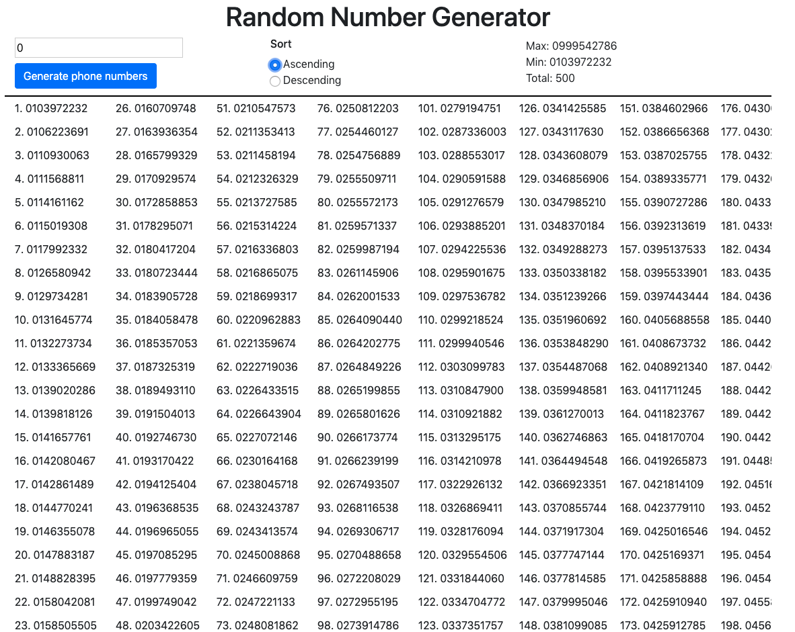

# Random Phone Number Generator

  

A react application for generating random number of phone numbers and storing them in a file

## How to test
- clone the repo
- run `yarn` to install dependencies
- run `yarn test` to test
- run `yarn start` to run the application locally

## Screenshot

